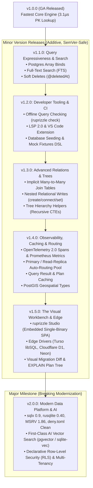

# Master v2 Roadmap & Multi-Version Release Pipeline

**Date:** 2026-08-22  
**Author:** Vaibhav Gupta <vaibhavgupta9877@gmail.com>  
**Status:** Approved Multi-Version Architecture Plan  
**Target Branch:** `dev-v2-x`  
**Baseline:** `1.0.0` / `dev-v0-2`  
**Reference Strategy:** [`ProjectPlan/v2/14_CompetitiveAnalysisAndMarketGains.md`](14_CompetitiveAnalysisAndMarketGains.md)

---

## 1. Executive Summary & Version Architecture

The **v2 Roadmap** represents the comprehensive multi-stage journey from `v1.0.0` through a series of additive, high-leverage minor releases (**v1.1**, **v1.2**, **v1.3**, **v1.4**, **v1.5**), culminating in the major, modernized **v2.0.0** data platform.

Each release version is strictly scoped to adhere to Rust SemVer rules:
- **v1.1 to v1.5 (Minor Releases):** 100% backwards-compatible, additive features, new tooling, new query builders, embedded studio, edge drivers, and observability.
- **v2.0 (Major Release):** Breaking modernization paying down public dependency debt (`sqlx 0.9`, `rusqlite 0.40`, MSRV 1.86), first-class `pgvector` & `sqlite-vec` AI embeddings, and declarative Row-Level Security (RLS).



---

## 2. Complete Version Matrix & Implementation Plan Index

| Version | Release Theme | Specification & Implementation Plan | Primary Crates Affected | SemVer Nature | Status |
|---|---|---|---|---|---|
| **v1.1** | **Query Expressiveness, Arrays & Search** | [`02_PostgresArraysAndRichTypesPlan.md`](02_PostgresArraysAndRichTypesPlan.md)<br>[`11_FullTextSearchAndSoftDeletesPlan.md`](11_FullTextSearchAndSoftDeletesPlan.md) | `core`, `parser`, `dialect`, `runtime`, `codegen` | Additive (Minor) | **Completed** |
| **v1.2** | **Developer Tooling, CI & Fixtures** | [`03_OfflineQueryCheckingPlan.md`](03_OfflineQueryCheckingPlan.md)<br>[`04_Lsp2AndDeveloperToolingPlan.md`](04_Lsp2AndDeveloperToolingPlan.md) | `check`, `lsp`, `cli`, `editor/vscode` | Additive (Minor) | **Completed** |
| **v1.3** | **Advanced Relations, Trees & Nested Writes** | [`12_NestedWritesAndTreeHierarchiesPlan.md`](12_NestedWritesAndTreeHierarchiesPlan.md) | `core`, `parser`, `codegen`, `runtime` | Additive (Minor) | **Completed** |
| **v1.4** | **Observability, Routing & Geospatial** | [`05_OpenTelemetryAndMetrics2Plan.md`](05_OpenTelemetryAndMetrics2Plan.md)<br>[`09_PrimaryReadReplicaRoutingPlan.md`](09_PrimaryReadReplicaRoutingPlan.md)<br>[`13_QueryCachingAndPostGISPlan.md`](13_QueryCachingAndPostGISPlan.md) | `runtime`, `core`, `dialect` | Additive (Minor) | Planned |
| **v1.5** | **The Visual Workbench & Edge Adapters** | [`06_RuprizzleStudioPlan.md`](06_RuprizzleStudioPlan.md)<br>[`08_EdgeAndServerlessAdaptersPlan.md`](08_EdgeAndServerlessAdaptersPlan.md) | `cli`, `editor/studio`, `crates/turso`, `crates/d1`, `crates/neon` | Additive (Minor) | Planned |
| **v2.0** | **Modern Data Platform, AI & Security** | [`01_DependencyModernizationPlan.md`](01_DependencyModernizationPlan.md)<br>[`07_AiVectorSearchPlan.md`](07_AiVectorSearchPlan.md)<br>[`10_RowLevelSecurityAndMultiTenancyPlan.md`](10_RowLevelSecurityAndMultiTenancyPlan.md) | Workspace-wide (`runtime`, `core`, `parser`, `migrate`) | Major (Breaking) | Planned |

---

## 3. Detailed Version Milestones & Release Breakdown

### 🎯 v1.1.0 — Query Expressiveness, Rich Types & Search (COMPLETED)
- **Deliverables:**
  - Postgres array bind values and typed operators (`.has()`, `.has_every()`, `.has_some()`, `.is_empty()`, `.is_not_empty()`).
  - Full-Text Search (FTS) across PostgreSQL (GIN/tsvector), SQLite (FTS5), and MySQL (FULLTEXT) with `.matches()`.
  - Declarative Soft Deletes (`@deletedAt`) with automatic query filtering, `.with_deleted()`, `.only_deleted()`, and `.soft_delete()`.
  - Automatic audit timestamps (`@createdAt`, `@updatedAt`).
- **Exit Gate:** 100% green tests on Postgres, SQLite, and MySQL; zero breaking changes to existing 1.0 code. Status: **VERIFIED & COMPLETED**.

### 🎯 v1.2.0 — Zero-DB CI Intelligence & Developer Tooling (COMPLETED)
- **Deliverables:**
  - Offline compile-time query checking engine (`ruprizzle check`) supporting `query-manifest.json`, AST semantic verification, parameter type checking, nullability validation, and GitHub Actions inline PR annotations (`::error file=...::`).
  - Ruprizzle LSP 2.0 with semantic completions (`@attributes`, types, relation `fields` and `references`, snippets), hover documentation, precise go-to-definition, and canonical formatting (`textDocument/formatting`).
  - Code actions and quick-fixes in VS Code extension (auto-inserting inverse relations, adding default `@id`, fixing scalar type typos).
  - Declarative database seeding and mock fixtures DSL (`ruprizzle seed`).
- **Exit Gate:** LSP server conformance suite passes; `ruprizzle check` runs in GitHub Actions CI with no database attached. Status: **VERIFIED & COMPLETED**.

### 🎯 v1.3.0 — Advanced Relations, Tree Hierarchies & Nested Mutations (COMPLETED)
- **Deliverables:**
  - Implicit Many-to-Many join tables (`model Post { tags Tag[] }` auto-synthesizing junction tables while preserving explicit join models).
  - Nested relational writes (`create`, `connect`, `connect_or_create`, `disconnect`, `set`) inside atomic transactions with rollback protection.
  - Tree and hierarchy query helpers via recursive CTEs (`.ancestors()`, `.descendants()`, `tree_from_root()`, `HierarchyNode`, cycle protection).
  - Polymorphic column filtering (`.filter_type()`).
- **Exit Gate:** Nested mutations and tree queries pass unit and integration tests across arbitrary relational graph depths. Status: **VERIFIED & COMPLETED**.

### 🎯 v1.4.0 — Production Observability, Caching & Scaled Data Routing
- **Deliverables:**
  - OpenTelemetry 2.0 semantic database spans (`db.system`, `db.statement.sanitized`, `db.operation`) and Prometheus metrics exporter (`ruprizzle_pool_connections_active`, `ruprizzle_query_duration_seconds`).
  - Primary / Read-Replica connection pool manager (`RoutedPool`) with automatic `SELECT` load balancing, primary write routing, and health failover.
  - Query result caching (in-memory LRU + Redis) with automatic mutation invalidation, plus AST query plan caching.
  - PostGIS geospatial scalar types (`Point`, `Polygon`, `MultiPolygon`) and spatial distance queries (`.within_radius()`, `.distance_to()`).
- **Exit Gate:** OTel spans conform to OpenTelemetry DB semantic conventions; read replicas distribute queries under high load soak tests.

### 🎯 v1.5.0 — Ruprizzle Studio & Edge Database Adapters
- **Deliverables:**
  - **Ruprizzle Studio:** Embedded visual data workbench single-binary hypermedia UI (Axum 0.8, Askama, HTMX 2.x, Alpine.js, Tailwind CSS) inside `ruprizzle-cli` booting in <15ms with zero Node/npm dependencies: table browser, live cell editor, clickable relation drawer navigation, interactive ERD graph, and SQL sandbox.
  - Live query plan visualizer (`EXPLAIN ANALYZE`) and migration safety diff preview.
  - Edge and serverless adapters: `ruprizzle-turso` (libSQL embedded replicas), `ruprizzle-d1` (Cloudflare D1 WASM/HTTP), `ruprizzle-neon` (Neon WebSocket driver).
- **Exit Gate:** Studio launches with zero external npm/Node dependencies and compiles purely via `cargo build`; Turso/D1 drivers pass dialect conformance tests.

### 🚀 v2.0.0 — Modern Data Platform, AI & Security (Major Release)
- **Deliverables:**
  - **Public Dependency Debt Paid Down:** Upgrade to `sqlx 0.9.0` (`SqlSafeStr`, `AssertSqlSafe`, `SqliteValue` bounds, `AnyArguments` lifetimes), `rusqlite 0.40.0`, MSRV raised to 1.86, and `deny.toml` RUSTSEC-2023-0071 exception permanently eliminated.
  - **First-Class AI Vector Search:** `Vector(dim)` schema type, `@@index(..., type: Hnsw, distance: Cosine)`, `.nearest_neighbors()`, and pgvector/sqlite-vec migration DDL.
  - **Declarative Row-Level Security (RLS) & Multi-Tenancy:** `@@tenant(field)` and `@@policy(...)` generating native Postgres RLS and transparent SQLite/MySQL query rewriting with `pool.with_tenant(...)`.
- **Exit Gate:** All 10 workspace crates compile on Rust 1.86+; full performance benchmarks rescore with sub-3µs PK lookups across all drivers.

---

## 4. Mechanical Verification Standard

All pull requests and milestone releases must pass the unified verification gate:

```powershell
# 1. Format & Linting
cargo fmt --all --check
cargo clippy --workspace --all-targets -- -D warnings

# 2. Test Suite & Native Driver Coverage
cargo test --workspace
$env:RUPRIZZLE_TEST_RUSQLITE=1; cargo test -p ruprizzle --features "sqlite-rusqlite,ruprizzle-testkit/sqlite-rusqlite"

# 3. Security, Advisories & Hardening
cargo deny check advisories
cargo xtask harden

# 4. Documentation
cargo doc --workspace --no-deps
```
