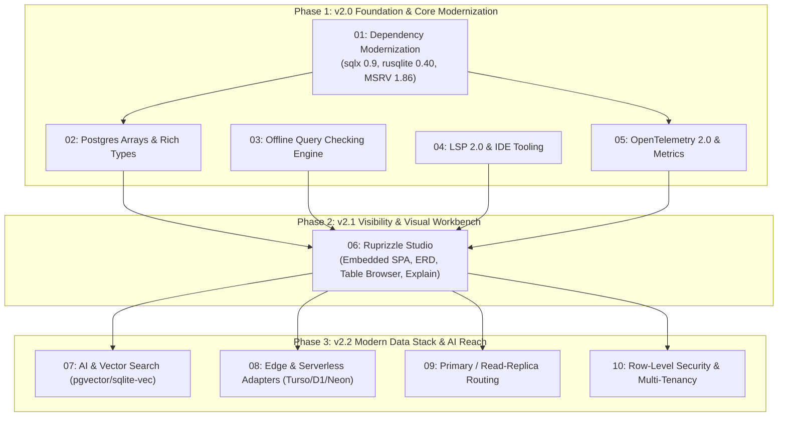

# Master v2 Implementation Roadmap & Orchestration Plan

**Date:** 2026-08-22  
**Author:** Vaibhav Gupta <vaibhavgupta9877@gmail.com>  
**Status:** Approved & Scheduled for Execution  
**Target Branch:** `dev-v2-x`  
**Baseline:** `1.0.0-rc.1` / `dev-v0-2`  
**Reference Document:** [`ProjectPlan/v2/V2FeaturesPlan.md`](V2FeaturesPlan.md)

---

## 1. Executive Summary & Architecture Overview

The `ruprizzle-orm` v2 release transforms `ruprizzle` from the fastest Rust relational query engine into a **complete, developer-first data platform**. 

While v1.0 established unmatched query performance (`3.1 µs` PK lookup vs Diesel's `9.9 µs`, Drizzle's `39.0 µs`, Prisma's `173.1 µs`), v2 delivers:
1. **Developer Experience & Visibility:** `ruprizzle studio` (embedded local GUI with table browser, ERD graph, and query explain visualizer).
2. **Confidence & CI Intelligence:** `ruprizzle check` (zero-DB compile-time query verification), rich LSP 2.0 with semantic autocompletions and quick-fixes.
3. **Modern Cloud & AI Runtime:** Native `pgvector` & `sqlite-vec` embeddings, edge/serverless database drivers (Turso, Cloudflare D1, Neon), primary/read-replica connection routing, OpenTelemetry 2.0 tracing, and declarative Row-Level Security (RLS).



---

## 2. Feature Plan Index & Specification Registry

| Plan ID & File | Feature Area | Primary Crates Affected | Complexity | Target Milestone |
|---|---|---|---|---|
| [`01_DependencyModernizationPlan.md`](01_DependencyModernizationPlan.md) | `sqlx 0.9` & `rusqlite 0.40` Modernization | `runtime`, `migrate`, `cli`, `dialect` | Medium | v2.0.0-alpha.1 |
| [`02_PostgresArraysAndRichTypesPlan.md`](02_PostgresArraysAndRichTypesPlan.md) | Postgres Array Binds & Rich Types | `core`, `dialect`, `runtime` | Small-Medium | v2.0.0-alpha.2 |
| [`03_OfflineQueryCheckingPlan.md`](03_OfflineQueryCheckingPlan.md) | Offline Query Verification (`ruprizzle check`) | `check`, `cli`, `runtime` | Medium | v2.0.0-beta.1 |
| [`04_Lsp2AndDeveloperToolingPlan.md`](04_Lsp2AndDeveloperToolingPlan.md) | Ruprizzle LSP 2.0 & VS Code Extension | `lsp`, `editor/vscode`, `parser` | Medium-Large | v2.0.0-beta.2 |
| [`05_OpenTelemetryAndMetrics2Plan.md`](05_OpenTelemetryAndMetrics2Plan.md) | OpenTelemetry Semantic DB Spans & Metrics | `runtime` | Small-Medium | v2.0.0-rc.1 |
| [`06_RuprizzleStudioPlan.md`](06_RuprizzleStudioPlan.md) | Ruprizzle Studio Visual Workbench | `cli`, `editor/studio` | Large | v2.1.0-beta.1 |
| [`07_AiVectorSearchPlan.md`](07_AiVectorSearchPlan.md) | AI & Vector Search (`pgvector`, `sqlite-vec`) | `core`, `parser`, `dialect`, `migrate`, `runtime` | Medium-Large | v2.2.0-alpha.1 |
| [`08_EdgeAndServerlessAdaptersPlan.md`](08_EdgeAndServerlessAdaptersPlan.md) | Edge & Serverless Adapters (Turso, D1, Neon) | `runtime`, `crates/turso`, `crates/d1`, `crates/neon` | Large | v2.2.0-beta.1 |
| [`09_PrimaryReadReplicaRoutingPlan.md`](09_PrimaryReadReplicaRoutingPlan.md) | Primary / Read-Replica Auto-Routing | `runtime` | Medium | v2.2.0-beta.2 |
| [`10_RowLevelSecurityAndMultiTenancyPlan.md`](10_RowLevelSecurityAndMultiTenancyPlan.md) | Row-Level Security (RLS) & Multi-Tenancy | `core`, `parser`, `dialect`, `migrate`, `runtime` | Medium | v2.2.0-rc.1 |

---

## 3. Phased Execution Roadmap

### Phase 1: v2.0 Foundation & Core Modernization (Target: Weeks 1–6)
- **Milestone 1.1 (Week 1):** Execute [`01_DependencyModernizationPlan.md`](01_DependencyModernizationPlan.md) to pay down public-dependency debt (`sqlx 0.9`, `rusqlite 0.40`, MSRV 1.86, RUSTSEC-2023-0071 clean).
- **Milestone 1.2 (Weeks 2–3):** Land [`02_PostgresArraysAndRichTypesPlan.md`](02_PostgresArraysAndRichTypesPlan.md) and [`05_OpenTelemetryAndMetrics2Plan.md`](05_OpenTelemetryAndMetrics2Plan.md).
- **Milestone 1.3 (Weeks 3–4):** Deliver [`03_OfflineQueryCheckingPlan.md`](03_OfflineQueryCheckingPlan.md) for full CI validation without database dependencies.
- **Milestone 1.4 (Weeks 4–6):** Ship [`04_Lsp2AndDeveloperToolingPlan.md`](04_Lsp2AndDeveloperToolingPlan.md), publish the updated VS Code extension to Marketplace and Open VSX.
- **Phase 1 Exit Gate:** All workspace crates compile on Rust 1.86+; mechanical gates (`cargo fmt`, `clippy -D warnings`, `test`, `harden`, `deny`) 100% green.

### Phase 2: v2.1 Visibility & Visual Workbench (Target: Weeks 7–11)
- **Milestone 2.1 (Weeks 7–8):** Embedded Axum backend & static asset bundle integration inside `ruprizzle-cli`.
- **Milestone 2.2 (Weeks 8–9):** Interactive Table Browser & Live Row Editor with relation click-through.
- **Milestone 2.3 (Weeks 9–10):** Visual ERD Diagram Generator from `schema.ruprizzle` AST and SQL Sandbox.
- **Milestone 2.4 (Weeks 10–11):** Migration safety diff preview and live `EXPLAIN (ANALYZE)` visual execution tree.
- **Phase 2 Exit Gate:** `ruprizzle studio` launches in <50ms with zero external runtime dependencies.

### Phase 3: v2.2 Modern Data Stack & AI Reach (Target: Weeks 12–17)
- **Milestone 3.1 (Weeks 12–13):** AI & Vector Search integration for Postgres (`pgvector`) and SQLite (`sqlite-vec`).
- **Milestone 3.2 (Weeks 14–15):** Edge driver crates for Turso (libSQL embedded replicas), Cloudflare D1, and Neon serverless.
- **Milestone 3.3 (Weeks 15–16):** Primary / Read-Replica dual pool manager with automatic write/read query routing.
- **Milestone 3.4 (Weeks 16–17):** Declarative Row-Level Security (`@@tenant`, `@@policy`) with migration DDL and runtime query scopes.
- **Phase 3 Exit Gate:** Full end-to-end integration tests across all dialects, vector benchmarks, and soak tests passing.

---

## 4. Cross-Cutting Verification Gates

Every pull request and milestone must satisfy the strict mechanical gates:

```powershell
# 1. Format & Linting
cargo fmt --all --check
cargo clippy --workspace --all-targets -- -D warnings

# 2. Test Suite & Rusqlite Feature Suite
cargo test --workspace
$env:RUPRIZZLE_TEST_RUSQLITE=1; cargo test -p ruprizzle --features "sqlite-rusqlite,ruprizzle-testkit/sqlite-rusqlite"

# 3. Security & Dependency Audit
cargo deny check advisories
cargo xtask harden

# 4. Documentation
cargo doc --workspace --no-deps
```

---

## 5. Branching & Release Strategy

- **Default Development Branch:** `dev-v2-x` (branched from `dev-v0-2`).
- **Feature Branches:** `feature/v2-<plan-id>-<short-description>` (e.g. `feature/v2-01-sqlx-09-upgrade`).
- **Tags:** `v2.0.0-alpha.1`, `v2.0.0-beta.1`, `v2.0.0-rc.1`, `v2.0.0`, `v2.1.0`, `v2.2.0`.
