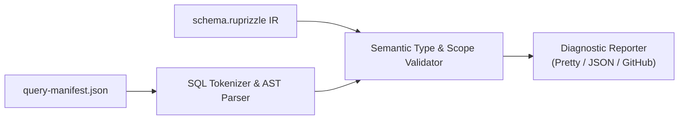

# Plan 03: Offline Query Verification (`ruprizzle check`)

**Date:** 2026-08-22  
**Author:** Vaibhav Gupta <vaibhavgupta9877@gmail.com>  
**Status:** Completed  
**Milestone:** v1.2.0 (Additive, Minor Release)  
**Primary Crates:** `crates/check`, `crates/cli`, `crates/runtime`, `crates/core`

---

## 1. Context, Objectives & Scope

Modern CI/CD workflows require static guarantees that application queries, raw SQL fragments, and generated filter expressions remain in sync with `schema.ruprizzle` **without requiring an active database server running during CI**.

In **v1.2**, `ruprizzle check` matures into a complete, AST-level zero-DB query type-checker and GitHub Actions CI gate:
1. **Query Manifest Schema (`query-manifest.json`):** Standardized JSON format emitted at build-time or query macro expansion capturing SQL string, parameter types, expected return types, and source code location.
2. **Deep Semantic AST Validation:**
   - Validates table existence and table alias scoping.
   - Verifies column names, nullability constraints, and foreign key references against `Schema` IR.
   - Type-checks WHERE clauses and bind parameters against schema field types (e.g. catches `id: String` passed to `Int` primary key).
   - Validates JOIN conditions and projection lists.
3. **CI Automation & GitHub Annotations:** `ruprizzle check --format github` emits standard `::error file={path},line={line}::{msg}` annotations to display inline code errors directly on GitHub Pull Requests.

---

## 2. Technical Architecture & Design

### 2.1 Query Manifest Data Model (`crates/check/src/manifest.rs`)

```rust
use serde::{Deserialize, Serialize};

#[derive(Debug, Clone, Serialize, Deserialize, PartialEq, Eq)]
pub struct QueryManifest {
    pub version: u32,
    pub schema_fingerprint: String,
    pub queries: Vec<QueryEntry>,
}

#[derive(Debug, Clone, Serialize, Deserialize, PartialEq, Eq)]
pub struct QueryEntry {
    pub id: String,
    pub sql: String,
    pub dialect: String,
    pub params: Vec<ParamSpec>,
    pub result_columns: Vec<ColumnSpec>,
    pub location: Option<SourceLocation>,
}

#[derive(Debug, Clone, Serialize, Deserialize, PartialEq, Eq)]
pub struct ParamSpec {
    pub name: Option<String>,
    pub position: usize,
    pub expected_type: String,
    pub nullable: bool,
}

#[derive(Debug, Clone, Serialize, Deserialize, PartialEq, Eq)]
pub struct ColumnSpec {
    pub name: String,
    pub inferred_type: String,
    pub nullable: bool,
}

#[derive(Debug, Clone, Serialize, Deserialize, PartialEq, Eq)]
pub struct SourceLocation {
    pub file: String,
    pub line: u32,
    pub column: u32,
}
```

### 2.2 Semantic AST Validation Pipeline (`crates/check/src/validate.rs`)



#### Verification Rules:
1. **Rule E01 - Unknown Table:** Referenced table or alias not found in `Schema::models`.
2. **Rule E02 - Unknown Column:** Selected or filtered column not found on model.
3. **Rule E03 - Type Mismatch:** Bind parameter type is incompatible with target column type.
4. **Rule E04 - Nullability Violation:** Non-nullable column assigned nullable bind parameter in INSERT or UPDATE.
5. **Rule E05 - Invalid Join Condition:** Join predicate does not match a valid foreign key relation or scalar equivalence.
6. **Rule E06 - Stale Schema Fingerprint:** `query-manifest.json` was generated against an older schema version.

---

## 3. CLI Subcommand Specification (`crates/cli`)

```powershell
ruprizzle check --schema ./schema.ruprizzle --manifest ./query-manifest.json --format github
```

### Output Formats:
- `--format pretty` (default): Colored human-readable output with code snippets and suggested fixes.
- `--format json`: Machine-readable diagnostic list for IDEs and scripts.
- `--format github`: GitHub Actions workflow command annotations:
  ```
  ::error file=src/users.rs,line=42,title=Ruprizzle Type Mismatch::Column `User.id` expects Int, received String
  ```

---

## 4. Step-by-Step Implementation Tasks

### Task 1: Manifest Schema & Serializer
- [x] In `crates/check/src/manifest.rs`:
  - Update `QueryManifest`, `QueryEntry`, `ParamSpec`, `ColumnSpec`, `SourceLocation` structures.
  - Implement serialization, deserialization, and schema fingerprint validation.

### Task 2: AST Semantic Validation Engine
- [x] In `crates/check/src/validate.rs`:
  - Enhance SQL tokenization and parser to extract table aliases, projections, joins, and WHERE expressions.
  - Implement type checking for bind parameters against `ruprizzle_core::ir::ScalarType`.
  - Add suggestion generator using Levenshtein distance for misspelled column/table names.

### Task 3: Rich Diagnostic Formatting
- [x] In `crates/check/src/report.rs`:
  - Implement `PrettyReporter` with miette/colored formatting.
  - Implement `JsonReporter`.
  - Implement `GitHubReporter` for CI workflow annotations.

### Task 4: CLI Integration
- [x] In `crates/cli/src/main.rs`:
  - Add `Check` subcommand with `--schema`, `--manifest`, and `--format` arguments.
  - Wire exit code handling (exit 0 on success, exit 1 on check failure).

### Task 5: Automated Testing & CI Harness
- [x] Add `crates/check/tests/validation_test.rs`:
  - Test valid queries pass with 0 errors.
  - Test unknown table detection.
  - Test unknown column detection.
  - Test bind parameter type mismatch detection.
  - Test GitHub annotation formatting.


---

## 5. Verification & Testing Strategy

```powershell
# 1. Run check crate tests
cargo test -p ruprizzle-check

# 2. Test CLI check command on sample manifest
cargo run -p ruprizzle-cli -- check --schema schema.ruprizzle --manifest test_manifest.json

# 3. Mechanical gates
cargo fmt --all --check
cargo clippy --workspace --all-targets -- -D warnings
```

---

## 6. Definition of Done

1. `ruprizzle check` validates complex queries containing SELECT, JOIN, WHERE, GROUP BY, and subqueries against `Schema` IR.
2. Catches table, column, type, nullability, and fingerprint mismatches.
3. Supports `--format github` with accurate file/line annotations.
4. 100% test coverage across error scenarios.
