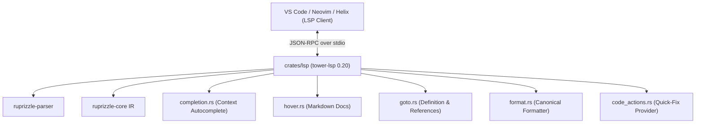

# Plan 04: Ruprizzle LSP 2.0 & Developer Tooling

**Date:** 2026-08-22  
**Author:** Vaibhav Gupta <vaibhavgupta9877@gmail.com>  
**Status:** Completed  
**Milestone:** v1.2.0 (Additive, Minor Release)  
**Primary Crates:** `crates/lsp`, `crates/parser`, `crates/core`, `editor/vscode`  
**Dependencies Baseline:** `tower-lsp 0.20.0`, `lsp-types 0.97.0`, VS Code Engine `^1.96.0`, `@vscode/vsce 3.2.0`

---

## 1. Context, Objectives & Scope

Writing `.ruprizzle` schemas without rich editor intelligence, real-time error underlines, and instant completions slows down developer velocity compared to TypeScript or modern Prisma 7.9+ schemas.

In **v1.2**, `crates/lsp` and the VS Code extension (`editor/vscode`) are upgraded into a **first-class Language Server Protocol (LSP 2.0) implementation** using `tower-lsp 0.20` and `lsp-types 0.97`:
- **Intelligent Autocompletions:** Context-aware completion of attributes, types, and relation parameters (`fields`, `references`).
- **Semantic Hover Tooltips:** Markdown documentation explaining attributes, data types, and dialect differences.
- **Go-To-Definition & References:** Seamless navigation between relations and models.
- **Canonical Formatting:** Native `textDocument/formatting` powered by the AST printer.
- **Code Actions & Quick-Fixes:** One-click fixes for missing inverse relations, missing primary keys, and type typos.
- **Marketplace Publishing:** Automated CI packaging for VS Code Marketplace and Open VSX Registry.

---

## 2. Technical Architecture & LSP Capabilities



### 2.1 Context-Aware Autocompletion (`completion.rs`)
- **Model Body Context:** Suggests scalar types (`Int`, `BigInt`, `String`, `Boolean`, `DateTime`, `Json`, `Decimal`, `Bytes`, `Vector`, `Point`, `Polygon`), declared enums, and existing model names.
- **Field Attribute Context (`@`):** Suggests `@id`, `@default(...)`, `@unique`, `@updatedAt`, `@deletedAt`, `@relation(...)`, `@map("...")`, `@db.VarChar(...)`.
- **Block Attribute Context (`@@`):** Suggests `@@id([...])`, `@@unique([...])`, `@@index([...])`, `@@map("...")`, `@@tenant(...)`, `@@policy(...)`.
- **Relation Arguments Context:**
  - `fields: [` $\to$ autocompletes scalar fields of the current model.
  - `references: [` $\to$ autocompletes primary key / unique fields of the referenced model.

### 2.2 Rich Hover Documentation (`hover.rs`)
Hovering over any keyword, type, or attribute displays rich Markdown documentation with usage examples and dialect support indicators:

```markdown
### `@default(uuid())`
Generates a random UUID v4 string default value upon insertion.

**Supported Dialects:** PostgreSQL, SQLite, MySQL  
**SQL Equivalent:**
- PostgreSQL: `gen_random_uuid()` (or `uuid_generate_v4()`)
- SQLite: Emulated via runtime generator
- MySQL: `UUID()`
```

### 2.3 Canonical Schema Formatting (`format.rs`)
Implements standard LSP `textDocument/formatting`. Automatically formats `.ruprizzle` files into clean tabular column layout:
```ruprizzle
model User {
  id        String   @id @default(uuid())
  email     String   @unique
  role      Role     @default(USER)
  posts     Post[]
  createdAt DateTime @default(now())
  updatedAt DateTime @updatedAt
}
```

### 2.4 Code Actions & Quick-Fixes (`code_actions.rs`)
- **Fix 1: Add Missing Inverse Relation:** When a model declares a 1:N relation to model `B`, offers a quick-fix on model `B` to insert the inverse `user User @relation(fields: [userId], references: [id])`.
- **Fix 2: Add Missing Primary Key:** Offers quick-fix `id String @id @default(uuid())` when a model has no `@id`.
- **Fix 3: Fix Misspelled Type:** Suggests `String` for `str` or `text`, `Int` for `int` or `integer`, `Boolean` for `bool`.

---

## 3. Step-by-Step Implementation Tasks

### Task 1: Enhance LSP Protocol Handlers in `crates/lsp`
- [x] In `crates/lsp/src/lib.rs`:
  - Register capabilities for `document_formatting_provider`, `code_action_provider`, `definition_provider`, `references_provider`, `hover_provider`, `completion_provider`.

### Task 2: Advanced Autocompletion Engine
- [x] In `crates/lsp/src/completion.rs`:
  - Implement cursor position context analysis (Inside Model, Field Type, Attribute, Relation Args).
  - Add dynamic completion for `fields: [...]` and `references: [...]` based on parsed AST models.
  - Add attribute argument snippets (e.g. `@relation(fields: [$1], references: [$2])`).

### Task 3: Hover Tooltips & Documentation Engine
- [x] In `crates/lsp/src/hover.rs`:
  - Build static markdown reference registry for all built-in types, attributes, and directives.
  - Add dynamic model/field summaries showing physical SQL table/column names when hovering model identifiers.

### Task 4: Canonical Code Formatter
- [x] In `crates/lsp/src/format.rs`:
  - Implement AST-based canonical pretty-printer for `.ruprizzle` files with whitespace preservation for comments.

### Task 5: Code Actions & Quick-Fix Engine
- [x] In `crates/lsp/src/code_actions.rs`:
  - Map parser diagnostic error codes to `CodeAction` with `WorkspaceEdit`.
  - Implement automatic inverse relation generator.
  - Implement typo quick-fixes.

### Task 6: VS Code Extension Packaging & CI
- [x] In `editor/vscode`:
  - Update `package.json` with configuration properties (`ruprizzle.lsp.path`, `ruprizzle.trace.server`) and VS Code engine `^1.96.0`.
  - Configure automated build and release GitHub Action for `.vsix` generation and publishing to VS Code Marketplace & Open VSX.


---

## 4. Verification & Testing Strategy

```powershell
# 1. Run LSP unit tests
cargo test -p ruprizzle-lsp

# 2. Test formatting and completions on sample schemas
cargo test -p ruprizzle-lsp --test completion_test
cargo test -p ruprizzle-lsp --test formatting_test

# 3. Mechanical gates
cargo fmt --all --check
cargo clippy --workspace --all-targets -- -D warnings
```

---

## 5. Definition of Done

1. LSP server handles all standard protocol methods (`completion`, `hover`, `goto`, `format`, `codeAction`, `diagnostics`) with zero panics.
2. Formatter standardizes schema layout cleanly with idempotent output.
3. Quick-fixes accurately generate inverse relations and resolve common syntax errors.
4. VS Code extension bundle builds cleanly and connects to the compiled language server binary.
