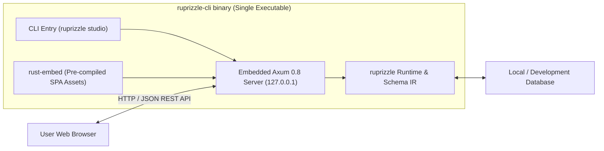

# Plan 06: Ruprizzle Studio — Embedded Visual Data & Schema Workbench

**Date:** 2026-08-22  
**Author:** Vaibhav Gupta <vaibhavgupta9877@gmail.com>  
**Status:** Ready for Execution  
**Milestone:** v1.5.0 (Phase 2 Headline Feature)  
**Primary Crates:** `crates/cli`, `editor/studio` (Frontend SPA)  
**Tech Stack Baseline:** React 19.x, Tailwind CSS v4.x, Vite 6.x, @xyflow/react 12.x, Axum 0.8.x, Tokio 1.44.x

---

## 1. Context, Objectives & Scope

Developers using `ruprizzle` often switch to external GUI database clients (TablePlus, DBeaver, psql, sqlite3) to inspect data, test queries, or understand relation graphs. Prisma Studio (with Prisma 7.9+) and Drizzle Studio proved that a zero-config, embedded web UI significantly accelerates schema iteration and debugging.

**Ruprizzle Studio** is a blazing-fast, local-first visual workbench launched via `ruprizzle studio`:
- **Single-Binary Zero-Dependency Deployment:** Pre-compiled static SPA (built with React 19, Tailwind CSS v4, Vite 6, Radix UI, and `@xyflow/react`) embedded directly into the `ruprizzle-cli` binary via `rust-embed`. End users require **zero Node.js or npm dependencies**.
- **Embedded Web Server:** High-performance local `axum 0.8` HTTP/WebSocket backend running inside `ruprizzle-cli`, binding exclusively to `127.0.0.1:5555`.
- **Fast Startup:** Boots in under **50ms** and automatically opens the user's default browser.



---

## 2. Core Studio Capabilities

### 2.1 Table Data Browser & Live Editor
- **Paginated Grid:** Virtualized scrolling table rendering up to 100,000+ rows smoothly with customizable page sizes (25, 50, 100, 500).
- **Type-Aware Filtering & Sorting:** Multi-column sorting and filtering (equals, contains, starts_with, greater_than, is_null, array_contains).
- **Inline Cell Editing:** Double-click cell editing with client-side type validation (UUID format, Date pickers, JSON schema tree editor, numeric bounds).
- **Row Insertion & Deletion:** Intuitive modal forms for inserting records with `@default(...)` previews and safe multi-row deletion confirmations.

### 2.2 Foreign Key Relation Traversal
- Foreign key values render as interactive badges.
- Clicking a relation badge (e.g. `userId: "usr_123"`) slides out a drawer or navigates directly to the linked `User` record with active breadcrumbs (`User -> Posts -> Comments`).

### 2.3 Interactive ERD Visualizer
- Dynamic interactive schema graph powered by `@xyflow/react` 12.x and `dagre`.
- Renders all models, field types, primary keys (`PK`), unique fields (`UQ`), and directional connector lines illustrating 1:1, 1:N, and N:M cardinality.
- Filter and search models; zoom and export ERD as SVG/PNG.

### 2.4 SQL Sandbox & `.to_sql()` Playground
- Visual query builder to construct queries without writing code.
- Real-time side-by-side view showing the exact parameterized SQL generated for PostgreSQL, SQLite, and MySQL.
- One-click query execution with latency breakdown and execution statistics.

### 2.5 Visual Migration Safety Diff
- Inspects pending schema differences between `schema.ruprizzle` and the live database.
- Displays color-coded diffs with risk classification badges (`SAFE`, `CAUTION`, `DESTRUCTIVE`).

### 2.6 Live `EXPLAIN (ANALYZE)` Plan Visualizer
- Visual node tree representation of database query execution plans (`EXPLAIN (ANALYZE, BUFFERS)`).
- Visual heatmaps highlighting bottlenecks, slow sequential scans, and expensive joins.

### 2.7 Safety Defaults
- **Read-Only Default:** Database modifications are disabled unless `--allow-writes` is passed.
- **Production Guardrail:** Automatically rejects database URLs containing `prod`, `production`, or remote hostnames unless `--yes-i-know` is explicitly provided.

---

## 3. Backend REST API Specification (`crates/cli/src/studio.rs`)

| Endpoint | Method | Description |
|---|---|---|
| `/api/schema` | `GET` | Returns parsed `Schema` IR, models, fields, and relations |
| `/api/models/:model/data` | `GET` | Paginated query rows with sorting and filters |
| `/api/models/:model/rows` | `POST` | Insert a new row (requires write mode) |
| `/api/models/:model/rows/:id` | `PATCH` | Update fields on a specific row (requires write mode) |
| `/api/models/:model/rows/:id` | `DELETE` | Delete a specific row (requires write mode) |
| `/api/query/to_sql` | `POST` | Compiles AST query payload into dialect SQL |
| `/api/query/execute` | `POST` | Executes query and returns rowset with execution time |
| `/api/query/explain` | `POST` | Runs `EXPLAIN (ANALYZE)` and returns execution plan JSON |
| `/api/migrations/diff` | `GET` | Calculates drift and pending migration changes |

---

## 4. Modern Frontend SPA Architecture (`editor/studio`)

```
editor/studio/
├── index.html
├── package.json         # React 19, Tailwind CSS v4, Vite 6, @xyflow/react 12
├── tsconfig.json
├── vite.config.ts
└── src/
    ├── main.tsx
    ├── App.tsx
    ├── api/             # Typed API client
    ├── components/
    │   ├── ui/          # Radix + Tailwind v4 primitives
    │   ├── layout/      # Sidebar, Navbar, Breadcrumbs
    │   ├── grid/        # Virtualized Data Table & Cell Editors
    │   ├── erd/         # React Flow (@xyflow/react) ERD Visualizer
    │   ├── sandbox/     # Query Playground & .to_sql() viewer
    │   ├── diff/        # Migration Safety Diff View
    │   └── explain/     # EXPLAIN Query Plan Tree
    └── store/           # Zustand 5 state management
```

---

## 5. Step-by-Step Implementation Tasks

### Task 1: Build Frontend SPA (`editor/studio`)
- [ ] Initialize React 19 + Vite 6 + TypeScript + Tailwind CSS v4 in `editor/studio`.
- [ ] Implement UI design system with Tailwind CSS v4 and Radix UI components.
- [ ] Build Data Grid with virtual scrolling, inline cell editing, and relation navigation badges.
- [ ] Build ERD Diagram visualizer with `@xyflow/react` 12.x.
- [ ] Build SQL Sandbox & `.to_sql()` playground.
- [ ] Build EXPLAIN Plan visualizer.
- [ ] Configure Vite build output to `editor/studio/dist`.

### Task 2: Embedded Static Asset Integration in `ruprizzle-cli`
- [ ] Add `rust-embed = "8.5"` dependency behind `feature = "studio"` in `crates/cli/Cargo.toml`.
- [ ] Embed `editor/studio/dist` assets and serve via Axum static file fallback handler.

### Task 3: Implement Embedded Studio REST API Server
- [ ] In `crates/cli/src/studio.rs`:
  - Implement Axum 0.8 router and API endpoints (`/api/schema`, `/api/models/:model/data`, etc.).
  - Implement write-mode guardrails (`--allow-writes`) and production URL validator (`--yes-i-know`).
  - Add auto-browser launcher (`opener` crate).

### Task 4: CLI Command Registration
- [ ] In `crates/cli/src/main.rs`:
  - Add `studio` subcommand with `--port`, `--host`, `--allow-writes`, `--browser`, and `--yes-i-know` flags.

### Task 5: Testing & Verification
- [ ] Add `crates/cli/tests/studio_test.rs`:
  - Test Axum API endpoints for schema introspection, pagination, and filter execution.
  - Test write guardrail enforcement in read-only mode.

---

## 6. Verification & Testing Strategy

```powershell
# 1. Build frontend bundle
cd editor/studio; npm install; npm run build; cd ../..

# 2. Build CLI with studio feature
cargo build -p ruprizzle-cli --features studio

# 3. Launch studio on test schema
cargo run -p ruprizzle-cli --features studio -- studio --schema ./examples/schema.ruprizzle

# 4. Mechanical gates
cargo fmt --all --check
cargo clippy --workspace --all-targets -- -D warnings
```

---

## 7. Definition of Done

1. `ruprizzle studio` starts a local web server and opens the browser within <50ms with zero runtime dependencies.
2. Full data browsing, sorting, filtering, and relation navigation working seamlessly.
3. Interactive ERD graph cleanly renders complex schemas with 50+ models.
4. Embedded single binary distributes cleanly without requiring Node/npm.
