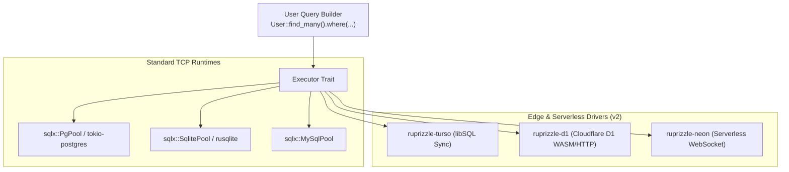

# Plan 08: Edge & Serverless Database Adapters (Turso, Cloudflare D1, Neon)

**Date:** 2026-08-22  
**Author:** Vaibhav Gupta <vaibhavgupta9877@gmail.com>  
**Status:** Ready for Execution  
**Milestone:** v2.2.0-beta.1  
**Primary Crates:** `crates/runtime`, new adapter crates (`crates/turso`, `crates/d1`, `crates/neon`)

---

## 1. Context, Objectives & Scope

Modern Rust web services deploy to Cloudflare Workers, Fastly Compute, AWS Lambda, and Vercel Edge. Standard long-lived TCP connection pools fail in serverless runtimes with short lifespans and restricted HTTP-only egress.

In v2, `ruprizzle` expands its runtime with **first-class Serverless and Edge database adapters**:
1. **Turso / libSQL (`ruprizzle-turso`):** Embedded SQLite replicas with automatic remote sync over HTTP/WebSocket. Zero-latency local reads combined with remote transactional writes.
2. **Cloudflare D1 (`ruprizzle-d1`):** WASM-compatible HTTP/Worker adapter binding directly to Cloudflare D1.
3. **Neon Serverless Postgres (`ruprizzle-neon`):** WebSocket and HTTP query pipeline bypassing TCP connection limits via Neon's connection pooler.
4. **Unified Seam Architecture:** All adapters implement the standard `Pool` and `Executor` traits, ensuring **identical query builder syntax** regardless of execution environment.

---

## 2. Technical Architecture & Trait Seams



---

### 2.1 Turso / libSQL Adapter (`crates/turso`)

```rust
use ruprizzle_turso::TursoPool;

// Local embedded replica with automatic background synchronization
let pool = TursoPool::builder()
    .local_path("local_replica.db")
    .sync_url("libsql://my-db-org.turso.io")
    .auth_token(std::env::var("TURSO_AUTH_TOKEN")?)
    .sync_interval(std::time::Duration::from_secs(60))
    .build()
    .await?;

// Reads hit local SQLite file with sub-millisecond latency:
let users = User::find_many().all(&pool).await?;

// Writes route transparently to primary via HTTP:
User::create()
    .email("alice@example.com")
    .save(&pool)
    .await?;
```

---

### 2.2 Cloudflare D1 Adapter (`crates/d1`)

- WASM-compatible driver compiled for `wasm32-unknown-unknown` and Cloudflare Workers.
- Executes queries via Cloudflare D1 REST API or direct JavaScript worker bindings (`worker::D1Database`).

```rust
#[cfg(target_arch = "wasm32")]
let pool = ruprizzle_d1::D1Pool::from_worker_env(&env, "DB")?;
let users = User::find_many().all(&pool).await?;
```

---

### 2.3 Neon Serverless Adapter (`crates/neon`)

- Connects over WebSockets or HTTP using Neon's serverless connection proxy.
- Eliminates TCP cold-start connection setup latency.

---

## 3. Step-by-Step Implementation Tasks

### Task 1: Decouple Executor & Connection Traits
- [ ] In `crates/runtime/src/executor.rs`:
  - Ensure `Executor` and `Connection` traits support WASM targets and custom transport drivers without hard-coded SQLx pool references.

### Task 2: Implement `crates/turso` Adapter
- [ ] Create `crates/turso` workspace member.
- [ ] Implement `TursoPool` wrapping `libsql::Builder`.
- [ ] Implement query compilation and row decoding bridging `libsql::Row` to `ruprizzle_runtime::Value`.

### Task 3: Implement `crates/d1` Adapter
- [ ] Create `crates/d1` workspace member.
- [ ] Implement HTTP client for Cloudflare D1 API.
- [ ] Add WASM feature flag for native Cloudflare Workers runtime bindings.

### Task 4: Implement `crates/neon` Adapter
- [ ] Create `crates/neon` workspace member.
- [ ] Implement Neon WebSocket and HTTP query transport.

### Task 5: Dialect Conformance Test Suite
- [ ] Add `tests/integration/tests/edge_adapters_test.rs`:
  - Test SQLite queries against local Turso embedded replica.
  - Verify dialect compatibility across select, joins, and aggregates.

---

## 4. Verification & Testing Strategy

```powershell
# 1. Run Turso adapter tests
cargo test -p ruprizzle-turso

# 2. Check WASM build for D1 adapter
cargo check -p ruprizzle-d1 --target wasm32-unknown-unknown

# 3. Mechanical gates
cargo fmt --all --check
cargo clippy --workspace --all-targets -- -D warnings
```

---

## 5. Definition of Done

1. `ruprizzle-turso` executes local reads and syncs remote writes on Turso libSQL.
2. `ruprizzle-d1` compiles for `wasm32-unknown-unknown` and executes queries on Cloudflare D1.
3. Query builder ergonomics remain 100% identical across standard and edge pool types.
