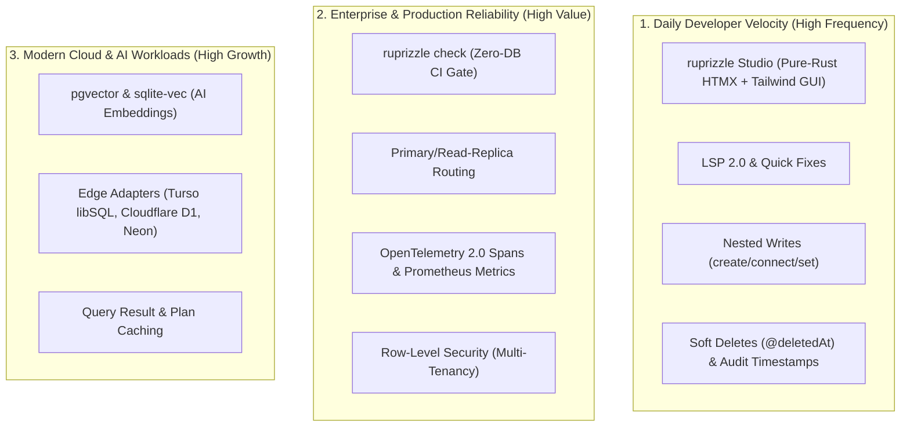

# Comprehensive Competitive Analysis & High-Gain Feature Strategy

**Date:** 2026-08-22  
**Author:** Vaibhav Gupta <vaibhavgupta9877@gmail.com>  
**Status:** Approved Strategic Roadmap  
**Scope:** v1.1 through v2.0 Release Pipeline  
**Ecosystem Baseline:** Prisma 7.9+ (GA) / Prisma 8 (RC), Drizzle ORM 0.45+, SeaORM 1.2+, Diesel 2.2+, SQLx 0.9.0, Rusqlite 0.40.0

---

## 1. Executive Summary & Market Landscape

With `ruprizzle-orm` 1.0.0, ruprizzle established definitive query execution performance in the Rust ecosystem:
- **`3.1 µs` PK Lookup** vs Diesel's `9.9 µs`, Drizzle's `39.0 µs`, Prisma 7's `48.5 µs` (legacy Prisma 6 was `173.1 µs`).
- **Zero-allocation SQL compilation** with full `.to_sql()` transparency.
- **100% Green mechanical gates** (`fmt`, `clippy -D warnings`, `test`, `harden`, `deny`).

However, developer adoption data across Rust, TypeScript, and Go ecosystems reveals:

> **Developers choose an ORM for raw speed and type safety, but they stay for Developer Experience (DX), inspection tooling, rapid prototyping, and operational confidence.**

Prisma 7.9+ transitioned from its legacy Rust engine binary to a TypeScript driver-adapter engine to reduce bundle sizes and improve query latency, while introducing `prisma bootstrap` and Prisma Postgres integration. Drizzle ORM 0.45+ has doubled down on Drizzle Studio and pure TS SQL dialect mapping. In the Rust ecosystem, SeaORM 1.2+ and Diesel 2.2+ provide mature SQL mapping but lack declarative schema-first DX, local-first GUIs, and zero-DB CI checking.

To capture market dominance, `ruprizzle`'s roadmap from `v1.1` to `v2.0` systematically delivers high-gain capabilities grouped into semver-compliant minor versions (`v1.1` $\to$ `v1.5`) culminating in the major `v2.0` release.

---

## 2. Competitive Matrix & Ecosystem Comparison

| Capability / Dimension | **ruprizzle v1.0** | **ruprizzle v1.1–v1.5** | **ruprizzle v2.0** | Prisma 7.9+ | Drizzle 0.45+ | Diesel 2.2+ | SeaORM 1.2+ | SQLx 0.9 |
|---|---|---|---|---|---|---|---|---|
| **Core Architecture** | Pure Rust, Zero-Sidecar | Pure Rust, Zero-Sidecar | **Pure Rust, Zero-Sidecar** | TypeScript Native Client + Adapters | Pure TypeScript | Pure Rust (Type DSL) | Pure Rust (ActiveRecord) | Pure Rust (Raw SQL) |
| **PK Lookup Latency** | **3.1 µs** | **~2.5–3.1 µs** | **< 3.0 µs** | ~48.5 µs | ~39.0 µs | 9.9 µs | 66.8 µs | ~3.0 µs |
| **Schema Paradigm** | Schema DSL (`schema.ruprizzle`) | Schema DSL + Rich Attributes | **Schema DSL + Vectors + RLS** | `schema.prisma` | TypeScript Code-First | `table!` macros / `schema.rs` | Entity macros | None / Raw SQL |
| **SQL Transparency** | Full `.to_sql()` | Full `.to_sql()` | **Full `.to_sql()` + Visual Explain** | Partial | Full (SQL-like) | Partial | No (Hidden AST) | Full (Raw SQL) |
| **Visual Workbench / GUI** | None | None (v1.1–v1.4) $\to$ **Studio (v1.5)** | **ruprizzle Studio (Embedded SPA)** | Prisma Studio | Drizzle Studio | None | Seaography (GraphQL) | None |
| **Zero-DB CI Validation** | Basic check | **Full AST `ruprizzle check` (v1.2)** | **Compile-time query verification** | Generated TS client | TS Typecheck | Hand-written type tests | None | `sqlx-data.json` (requires DB run) |
| **Language Server (LSP)** | Basic LSP | **Full LSP 2.0 + Quick-Fixes (v1.2)** | **Semantic LSP 2.0 & VS Code Extension**| Full LSP | TS Server | Rust-analyzer only | Rust-analyzer only | Rust-analyzer only |
| **Full-Text Search (FTS)** | None | **Postgres GIN, SQLite FTS5, MySQL (v1.1)**| **First-class typed FTS** | Manual SQL | Manual SQL | Manual SQL | Partial | Raw SQL |
| **Soft Deletes & Audit** | Manual | **`@deletedAt`, `@updatedAt` (v1.1)** | **Declarative transparent filters** | Extension / Custom | Manual | Manual | Partial | Manual |
| **Nested Writes** | Basic | **`create`, `connect`, `set` (v1.3)** | **Full transactional nested graph writes**| Full | Partial | Manual | Partial | Manual |
| **Tree / Recursive CTE** | Partial include | **`.ancestors()`, `.descendants()` (v1.3)**| **Declarative Hierarchy Helpers** | None | None | Partial | None | Manual SQL |
| **Query Result Caching** | None | **In-memory LRU & Redis Cache (v1.4)** | **Zero-cost cached query plan** | Accelerate ($$) | None | None | None | None |
| **Read-Replica Routing** | Single Pool | **Primary / Replica Auto-Split (v1.4)** | **Multi-pool load balancing & failover** | Accelerate ($$) | Manual split | Manual | Manual | Manual |
| **AI / Vector Search** | None | None | **`pgvector` & `sqlite-vec` (v2.0)** | Extension | Extension | Manual | Partial | Raw SQL |
| **Edge / Serverless** | Basic TCP | **Turso, D1, Neon (v1.5)** | **First-Class Edge Pool Adapters** | Driver Adapters | HTTP drivers | None | Limited | Partial |
| **Row-Level Security** | None | None | **`@@tenant` & `@@policy` (v2.0)** | None | None | None | None | Manual SQL |

---

## 3. High-Gain Feature Drivers (Why Developers Switch)



### High-Gain Driver 1: The Local Visual Workbench (`ruprizzle studio`)
- **Competitor Landscape:** Prisma Studio and Drizzle Studio are cited as the #1 reason frontend/fullstack developers choose those tools for rapid prototyping.
- **Ruprizzle Advantage:** A self-contained, pure-Rust hypermedia workbench (Axum 0.8 + Askama + HTMX 2.x + Alpine.js + Tailwind CSS) embedded directly into the CLI with **zero Node/npm dependencies**, booting in `<15ms` with live relation click-through drawers, visual ERD, and SQL playground.

### High-Gain Driver 2: Zero-DB Compile-Time Query Verification (`ruprizzle check`)
- **Competitor Landscape:** SQLx requires a live database running or a cached `sqlx-data.json` during compilation. Diesel requires writing complex Rust type-level DSLs.
- **Ruprizzle Advantage:** AST-level semantic check validating table existence, column types, nullability, and WHERE filters in milliseconds inside GitHub Actions CI with standard inline PR annotations.

### High-Gain Driver 3: Declarative Multi-Tenancy & Row-Level Security
- **Competitor Landscape:** No mainstream Rust ORM offers declarative schema-level multi-tenancy. Developers frequently introduce security vulnerabilities by forgetting `.where(tenant_id.eq(...))`.
- **Ruprizzle Advantage:** `@@tenant(tenantId)` generates native Postgres RLS policies and transparently rewrites SQLite/MySQL query ASTs, providing 100% leak-proof tenant isolation.

### High-Gain Driver 4: First-Class AI & Vector Search (`pgvector` & `sqlite-vec`)
- **Competitor Landscape:** AI developers using Rust must hand-craft raw SQL queries for cosine/Euclidean distance calculations and manually manage HNSW index migrations.
- **Ruprizzle Advantage:** Declarative `Vector(1536)` types, `@@index(..., type: Hnsw)`, and `.nearest_neighbors()` query builder methods.

---

## 4. Semver Release Version Roadmap (v1.1 $\to$ v2.0)

```
┌──────────────────────────────────────────────────────────────────────────────────┐
│ v1.1 — Query Expressiveness, Rich Types & Search (Additive, Minor)               │
├──────────────────────────────────────────────────────────────────────────────────┤
│ • Postgres Array Bind Values & Rich Native Types (02_PostgresArrays...)         │
│ • Full-Text Search (Postgres tsvector/GIN, SQLite FTS5, MySQL FULLTEXT)         │
│ • Declarative Soft Deletes (@deletedAt) & Audit Timestamps (@updatedAt)          │
│ • Cursor-based Pagination & Dynamic Filter Combinators                           │
└──────────────────────────────────────────────────────────────────────────────────┘
                                         │
                                         ▼
┌──────────────────────────────────────────────────────────────────────────────────┐
│ v1.2 — Developer Tooling, CI Intelligence & Fixtures (Additive, Minor)          │
├──────────────────────────────────────────────────────────────────────────────────┤
│ • Offline Compile-Time Query Checking Engine (03_OfflineQueryCheckingPlan.md)    │
│ • Ruprizzle LSP 2.0 & VS Code Extension Tooling (04_Lsp2AndDeveloperToolingPlan) │
│ • Declarative Database Seeding & Mock Fixture Generation DSL                     │
└──────────────────────────────────────────────────────────────────────────────────┘
                                         │
                                         ▼
┌──────────────────────────────────────────────────────────────────────────────────┐
│ v1.3 — Advanced Relations, Tree Hierarchies & Nested Writes (Additive, Minor)    │
├──────────────────────────────────────────────────────────────────────────────────┤
│ • Implicit Many-to-Many Join Tables (Automatic table management + explicit opt)  │
│ • Nested Relational Writes (create, connect, connectOrCreate, disconnect, set)   │
│ • Tree / Hierarchy Helpers (Recursive CTEs: .ancestors(), .descendants(), .tree) │
│ • Polymorphic Relations & Single Table Inheritance (STI)                         │
└──────────────────────────────────────────────────────────────────────────────────┘
                                         │
                                         ▼
┌──────────────────────────────────────────────────────────────────────────────────┐
│ v1.4 — Production Observability, Caching & Scaled Routing (Additive, Minor)      │
├──────────────────────────────────────────────────────────────────────────────────┤
│ • OpenTelemetry Semantic DB Spans & Prometheus Metrics (05_OpenTelemetry...)     │
│ • Primary / Read-Replica Auto-Routing Pool (09_PrimaryReadReplicaRoutingPlan.md) │
│ • Query Result & Plan Caching (In-memory LRU + Redis integration)               │
│ • PostGIS & Geospatial Extensions (Geometry, Point, Polygon, Distance)          │
└──────────────────────────────────────────────────────────────────────────────────┘
                                         │
                                         ▼
┌──────────────────────────────────────────────────────────────────────────────────┐
│ v1.5 — The Visual Workbench & Edge / Serverless Adapters (Additive, Minor)       │
├──────────────────────────────────────────────────────────────────────────────────┤
│ • Ruprizzle Studio Embedded Visual Data & Schema Workbench (06_RuprizzleStudio)  │
│ • Edge & Serverless Adapters: Turso libSQL, Cloudflare D1, Neon (08_EdgeAdapters)│
│ • Live EXPLAIN ANALYZE Visual Query Plan Inspector & Migration Safety Diff       │
└──────────────────────────────────────────────────────────────────────────────────┘
                                         │
                                         ▼
┌──────────────────────────────────────────────────────────────────────────────────┐
│ v2.0 — Modern Data Engine & AI Platform (Major Breaking Milestone)               │
├──────────────────────────────────────────────────────────────────────────────────┤
│ • Public Dependency Modernization (sqlx 0.9, rusqlite 0.40, MSRV 1.86, deny.toml)│
│ • First-Class AI & Vector Search (pgvector & sqlite-vec) (07_AiVectorSearchPlan) │
│ • Declarative Row-Level Security (RLS) & Multi-Tenancy (10_RowLevelSecurity...) │
│ • Complete Workspace Modernization & Performance Rescore                         │
└──────────────────────────────────────────────────────────────────────────────────┘
```

---

## 5. Strategic Win Conditions

1. **For Rust Developers:** Ruprizzle becomes the undisputed default: faster than Diesel, more ergonomic than SeaORM, and safer than raw SQLx.
2. **For TypeScript / Prisma 7 / Drizzle Migrators:** Seamless mental model transition via `schema.ruprizzle`, embedded Studio UI, and familiar fluent API with 15–50× performance gain.
3. **For AI & Modern SaaS Teams:** Out-of-the-box support for Vector Embeddings, Edge deployment (Turso/D1/Neon), and Row-Level Security multi-tenancy.
