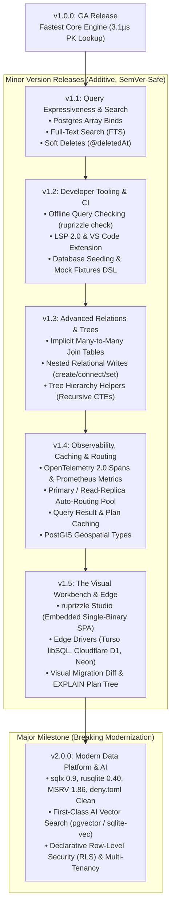

# v2 Master Features & Release Architecture Plan (v1.1 → v2.0)

**Date:** 2026-08-22  
**Author:** Vaibhav Gupta <vaibhavgupta9877@gmail.com>  
**Status:** Approved Multi-Version Engineering Architecture  
**Baseline:** `1.0.0` (Published on crates.io, baseline branch `dev-v0-2`). All mechanical gates (`fmt`, `clippy -D warnings`, `test`, `harden`, `deny`) are **100% green** across all ten workspace crates.  
**Target Branch:** `dev-v2-x`  
**Builds on:** [`ProjectPlan/v1/PathToStableV1.md`](../v1/PathToStableV1.md) and [`ProjectPlan/v2/14_CompetitiveAnalysisAndMarketGains.md`](14_CompetitiveAnalysisAndMarketGains.md).

---

## 1. Executive Summary & The Multi-Version Journey

With the release of `1.0.0`, `ruprizzle-orm` established itself as the fastest and most reliable relational ORM in the Rust ecosystem (`3.1 µs` PK lookup vs Diesel's `9.9 µs`, Drizzle's `39.0 µs`, Prisma's `173.1 µs` per `docs/BenchmarkResults.md`).

However, developer analysis and ecosystem telemetry show:

> **Developers choose ORMs for performance, but they stay for Developer Experience (DX), inspection tooling, rapid prototyping, and operational confidence.**

The **v2 Plan** defines the comprehensive engineering roadmap from `v1.0.0` across additive minor versions (**v1.1**, **v1.2**, **v1.3**, **v1.4**, **v1.5**), culminating in the major, modernized **v2.0.0** data platform:
1. **v1.1 (Query Expressiveness & Search):** Postgres Array Binds, Full-Text Search (FTS), Soft Deletes (`@deletedAt`), and Audit Timestamps (`@updatedAt`).
2. **v1.2 (Developer Tooling & Zero-DB CI):** Offline Query Checking (`ruprizzle check`), Ruprizzle LSP 2.0 with semantic autocompletions & quick-fixes, and Declarative Seeding DSL.
3. **v1.3 (Advanced Relations & Trees):** Implicit Many-to-Many join tables, Nested Relational Writes 2.0 (`create`, `connect`, `set`), and Tree Hierarchy Helpers (Recursive CTEs).
4. **v1.4 (Observability, Caching & Scaled Routing):** OpenTelemetry 2.0 DB Spans & Prometheus Metrics, Primary / Read-Replica Auto-Routing Pool, Query Result & Plan Caching, and PostGIS Geospatial.
5. **v1.5 (The Visual Workbench & Edge):** Ruprizzle Studio Embedded Single-Binary SPA, Edge/Serverless Drivers (Turso libSQL, Cloudflare D1, Neon), Visual Migration Diff & Live `EXPLAIN ANALYZE` Tree.
6. **v2.0 (Modern Data Platform & AI):** Public Dependency Modernization (`sqlx 0.9`, `rusqlite 0.40`, MSRV 1.86), First-Class AI Vector Search (`pgvector` & `sqlite-vec`), and Declarative Row-Level Security (RLS) & Multi-Tenancy.

---

## 2. Multi-Version Release Matrix



---

## 3. Implementation Plans Index

All detailed, task-by-task engineering plans are recorded as markdown files within [`ProjectPlan/v2/`](./):

1. [**`00_MasterV2RoadmapPlan.md`**](00_MasterV2RoadmapPlan.md) — Master Orchestration & Multi-Version Release Pipeline
2. [**`01_DependencyModernizationPlan.md`**](01_DependencyModernizationPlan.md) — Public Dependency Debt (`sqlx 0.9`, `rusqlite 0.40`, MSRV 1.86, RUSTSEC-2023-0071 clean) [Target: **v2.0**]
3. [**`02_PostgresArraysAndRichTypesPlan.md`**](02_PostgresArraysAndRichTypesPlan.md) — Postgres Array Bind Values & Rich Native Types [Target: **v1.1** — **COMPLETED**]
4. [**`03_OfflineQueryCheckingPlan.md`**](03_OfflineQueryCheckingPlan.md) — Offline / Compile-Time Query Verification (`ruprizzle check`) [Target: **v1.2** — **COMPLETED**]
5. [**`04_Lsp2AndDeveloperToolingPlan.md`**](04_Lsp2AndDeveloperToolingPlan.md) — Ruprizzle LSP 2.0 & Developer Tooling [Target: **v1.2** — **COMPLETED**]
6. [**`05_OpenTelemetryAndMetrics2Plan.md`**](05_OpenTelemetryAndMetrics2Plan.md) — OpenTelemetry Semantic DB Spans & Prometheus Metrics 2.0 [Target: **v1.4**]
7. [**`06_RuprizzleStudioPlan.md`**](06_RuprizzleStudioPlan.md) — Ruprizzle Studio Embedded Visual Data & Schema Workbench [Target: **v1.5**]
8. [**`07_AiVectorSearchPlan.md`**](07_AiVectorSearchPlan.md) — AI & Vector Search (`pgvector` & `sqlite-vec`) [Target: **v2.0**]
9. [**`08_EdgeAndServerlessAdaptersPlan.md`**](08_EdgeAndServerlessAdaptersPlan.md) — Edge & Serverless Database Adapters (Turso, D1, Neon) [Target: **v1.5**]
10. [**`09_PrimaryReadReplicaRoutingPlan.md`**](09_PrimaryReadReplicaRoutingPlan.md) — Primary / Read-Replica Connection Routing [Target: **v1.4**]
11. [**`10_RowLevelSecurityAndMultiTenancyPlan.md`**](10_RowLevelSecurityAndMultiTenancyPlan.md) — Row-Level Security (RLS) & Multi-Tenant Primitives [Target: **v2.0**]
12. [**`11_FullTextSearchAndSoftDeletesPlan.md`**](11_FullTextSearchAndSoftDeletesPlan.md) — Full-Text Search, Soft Deletes & Audit Timestamps [Target: **v1.1** — **COMPLETED**]
13. [**`12_NestedWritesAndTreeHierarchiesPlan.md`**](12_NestedWritesAndTreeHierarchiesPlan.md) — Advanced Relations, Tree Hierarchies & Nested Writes [Target: **v1.3** — **COMPLETED**]
14. [**`13_QueryCachingAndPostGISPlan.md`**](13_QueryCachingAndPostGISPlan.md) — Query Result & Plan Caching, PostGIS Geospatial [Target: **v1.4**]
15. [**`14_CompetitiveAnalysisAndMarketGains.md`**](14_CompetitiveAnalysisAndMarketGains.md) — Comprehensive Competitive Analysis & Strategic Market Gains

---

## 4. Architectural Safeguards & Non-Goals

1. **Zero Sidecars or Node Daemons:** All tooling (`ruprizzle studio`, `check`, `lsp`, `cli`) compiles into self-contained Rust binaries with zero external Node.js/npm dependencies for end users.
2. **Relational Core Integrity:** Relational and hybrid-relational (JSONB, Vector, Spatial) workloads remain the absolute focus. Unstructured document stores (MongoDB, Cassandra) remain strictly out of scope.
3. **Zero Runtime Allocation Regressions:** Every new builder method, macro, or adapter must satisfy zero-cost compilation rules and pass `cargo xtask harden` and `cargo xtask bench`.

---

## 5. Mechanical Verification Standard

```powershell
cargo fmt --all --check
cargo clippy --workspace --all-targets -- -D warnings
cargo test --workspace
$env:RUPRIZZLE_TEST_RUSQLITE=1; cargo test -p ruprizzle --features "sqlite-rusqlite,ruprizzle-testkit/sqlite-rusqlite"
cargo doc --workspace --no-deps
cargo xtask harden
```
