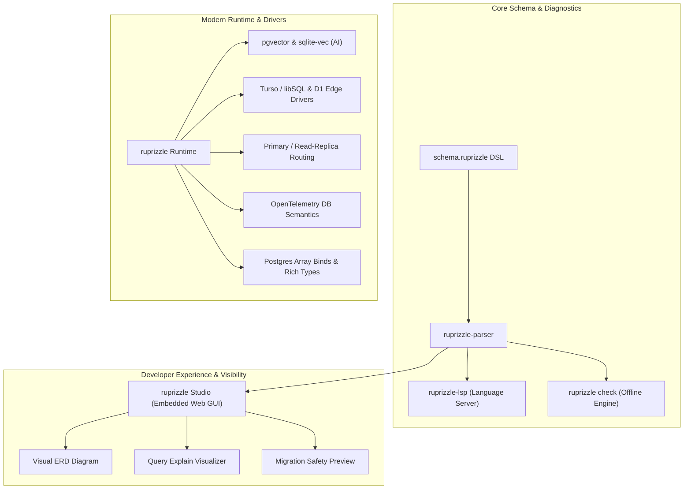

# v2 Features Plan — The High-Performance Developer Experience Platform

**Date:** 2026-08-21  
**Author:** Vaibhav Gupta <vaibhavgupta9877@gmail.com>  
**Status:** Approved & Scheduled for v2 Cycle  
**Baseline:** `1.0.0-rc.1` (Published on crates.io 2026-08-21, branch `dev-v0-2`). All mechanical gates (`fmt`, `clippy -D warnings`, `test`, `harden`, `deny`) are **100% green** across all ten workspace crates.  
**Builds on:** [`ProjectPlan/v1/PathToStableV1.md`](../v1/PathToStableV1.md), which delivers the 1.0 stability, semver commitment, and core query engine parity (Postgres, SQLite, MySQL, savepoints, CTEs, joins, aggregates, streaming).

---

## 1. Executive Summary & Market Landscape

### 1.1 The v2 Strategic Mission
With the release of `1.0.0-rc.1`, `ruprizzle-orm` has established itself as the fastest and most reliable relational ORM in the Rust ecosystem (`3.1 µs` PK lookup vs Diesel's `9.9 µs`, Drizzle's `39.0 µs`, Prisma's `173.1 µs` per `docs/BenchmarkResults.md`).

However, customer research (`customer-research.md`) and market analysis across TypeScript and Rust ecosystems (Prisma, Drizzle, SeaORM, Diesel, SQLx, Toasty, Prax) reveal a definitive pattern:

> **Developers choose ORMs for performance, but they stay for Developer Experience (DX), visibility, and confidence.**

While `ruprizzle` v1 perfected SQL generation and runtime execution, **v2 transforms ruprizzle into a complete data platform**:
1. **Visibility & Inspection:** Local-first visual data browser & ERD studio (`ruprizzle studio`), visual migration safety diffing, and `EXPLAIN ANALYZE` visualizer.
2. **Confidence & Tooling:** Zero-DB compile-time query verification (`ruprizzle check`), rich LSP editor intelligence with semantic completions and quick fixes, and deep IDE integration.
3. **Modern Data Stacks:** Native `pgvector` & `sqlite-vec` AI embeddings, Edge/Serverless drivers (Turso/libSQL, Cloudflare D1, Neon), Primary/Replica connection routing, and OpenTelemetry observability.

---

### 1.2 Competitive Matrix & Ecosystem Positioning

| Dimension | ruprizzle v1.0 | **ruprizzle v2.0 (Target)** | Prisma 6 | Drizzle | SeaORM 1.1 | Diesel 2.2 | SQLx 0.8 |
|---|---|---|---|---|---|---|---|
| **Core Architecture** | Pure Rust, Zero-Sidecar | **Pure Rust, Zero-Sidecar** | Node + Rust Sidecar engine | Pure TypeScript | Pure Rust (ActiveRecord) | Pure Rust (Type DSL) | Pure Rust (Raw SQL) |
| **Schema Paradigm** | Schema-first (`schema.ruprizzle`) | **Schema-first + Rich Types** | `schema.prisma` | TypeScript Code-First | Entity derive macros | `table!` / `schema.rs` | None / Raw SQL migrations |
| **SQL Transparency** | Full `.to_sql()` | **Full `.to_sql()` + Visual Explain** | Partial | Full (SQL-like) | No (Hidden AST) | Partial | Full (Raw SQL) |
| **Visual Studio / GUI** | None | **ruprizzle Studio (Embedded SPA)** | Prisma Studio | Drizzle Studio | Seaography (GraphQL) | None | None |
| **Offline CI Checking** | Scaffolded (`crates/check`) | **Full Query Manifest & Type Validation** | Generated client types | TS Typecheck | None | Hand-written type tests | `sqlx-data.json` |
| **Language Server (LSP)**| Scaffolded (`crates/lsp`) | **Full Semantic LSP + Quick-Fixes** | Full LSP | TS Server | Rust-analyzer only | Rust-analyzer only | Rust-analyzer only |
| **AI / Vector Search** | None | **First-Class `pgvector` & `sqlite-vec`** | Manual extensions | Manual extensions | Partial (`pgvector`) | Manual SQL | Raw SQL |
| **Edge / Serverless** | Basic connection | **Turso (Embedded Replica), D1, Neon** | Accelerate / Proxy | HTTP driver adapters | Limited | No | Partial |
| **Connection Routing** | Single Pool | **Primary / Read-Replica Auto-Split** | Prisma Accelerate | Manual split | Manual connection | Manual connection | Manual connection |
| **Observability** | Tracing events & Slow Query | **OpenTelemetry Semantic DB Spans & Metrics** | Tracing / Pulse | None | `tracing` spans | `tracing` | `tracing` |
| **Postgres Array Binds** | Rejected at bind | **First-Class Typed Array Round-Tripping** | Yes | Yes | Yes | Yes | Yes |

---

## 2. Core v2 Feature Specifications



---

### 2.1 Ruprizzle Studio — Embedded Visual Data & Schema Workbench (Headline Feature)

**Problem:** Today, developers using `ruprizzle` must switch to third-party tools (TablePlus, DBeaver, psql, sqlite3) to inspect data, test queries, or understand relation graphs. Prisma and Drizzle proved that an integrated, zero-config local UI dramatically accelerates prototyping and debugging.

**Solution:** A lightweight, blazing-fast local web UI launched via `ruprizzle studio`:
- **Single-Binary Zero-Dependency Deployment:** Pre-compiled static single-page app (SPA built with React/Vite and modern Tailwind/Radix components) embedded directly into the `ruprizzle-cli` binary using `rust-embed` or `include_dir!`. Zero external Node/npm dependencies required by the user.
- **Embedded Asynchronous Backend:** Embedded web server inside `ruprizzle-cli` (behind `feature = "studio"`) using `axum` / `tower-http` binding exclusively to `127.0.0.1`.
- **Core Capabilities:**
  1. **Table Data Browser & Live Editor:** Paginated row view, column sorting, multi-column search/filtering, inline cell editing (with type-validated inputs), row insertion, and soft/hard deletion.
  2. **Relation Traversal:** Interactive clickable foreign keys that seamlessly navigate between parent and child models (e.g. `User -> Posts -> Comments`).
  3. **Interactive ERD Visualizer:** Dynamic graphical entity-relationship diagram generated directly from `schema.ruprizzle`, showing models, fields, types, indexes, and foreign-key cardinality.
  4. **SQL Sandbox & `.to_sql()` Playground:** Visual query builder where users can compose filters, view generated parameterized SQL, and test query execution with real-time latency stats.
  5. **Visual Migration Safety Diff:** Preview pending schema changes side-by-side with destructive migration risk indicators before executing `migrate dev` or `db push`.
  6. **Live Query Plan Visualizer:** Visual execution tree for `EXPLAIN (ANALYZE, BUFFERS)` on Postgres / SQLite / MySQL.
- **Safety Defaults:**
  - Read-only by default; writes require `--allow-writes` flag.
  - Rejection of production database URLs without explicit `--yes-i-know` override.

**Effort:** Large (~3.5–4.5 weeks).  
**Crates Affected:** `crates/cli`, new frontend submodule `editor/studio`.

---

### 2.2 Offline / Compile-Time Query Verification (`ruprizzle check`)

**Problem:** In CI/CD pipelines and team development environments, developers want guarantees that dynamic queries, raw fragments, and filters match the current schema *without* requiring an active database server running during CI type-checking.

**Solution:** Elevate `crates/check` into a complete zero-DB validation engine:
- **Query Manifest Specification (`query-manifest.json`):** A lightweight, standardized schema and query manifest format generated at build time or emitted by query builder macros.
- **AST-Level Semantic Validation:**
  - Tokenizes and parses queries to validate table existence, column names, column nullability, and foreign key references against `Schema` IR.
  - Type-checks WHERE clauses and bind parameters against declared schema field types (e.g. catches `id: String` passed to `Int` primary key).
  - Validates JOIN conditions and projection lists.
- **CI Automation:** `ruprizzle check --schema schema.ruprizzle --manifest queries.json` exits with code 0 on success or returns structured GitHub-actions-compatible annotations and diagnostics with file, line, and suggested fixes.

**Effort:** Medium (~1.5–2 weeks).  
**Crates Affected:** `crates/check`, `crates/cli`, `crates/runtime`.

---

### 2.3 Ruprizzle LSP 2.0 & Developer Tooling

**Problem:** Writing `.ruprizzle` schemas without intelligent auto-completion, doc hovers, and real-time error underlines reduces developer velocity compared to TypeScript schemas.

**Solution:** Mature `crates/lsp` and the VS Code extension (`editor/vscode`) into a first-class language server:
- **Rich Language Server Protocol Capabilities:**
  1. **Diagnostics:** Immediate schema syntax errors, missing primary keys, invalid relation references, duplicate fields, unsupported types per provider.
  2. **Intelligent Autocompletion:**
     - Attribute completions (`@id`, `@default(...)`, `@unique`, `@updatedAt`, `@relation(...)`, `@map(...)`).
     - Type completions (scalars, enums, referenced model types).
     - Field-level completions for relation arguments (`fields: [...]`, `references: [...]`).
  3. **Hover Documentation:** Rich Markdown hover info explaining attributes, data types, indexes, and dialect compatibility.
  4. **Go-To-Definition & Find References:** Jump instantly between relation fields and target models.
  5. **Formatting:** Native `textDocument/formatting` powered by `ruprizzle-parser` canonical printer.
  6. **Code Actions / Quick-Fixes:** Automatically insert missing relation fields on inverse models, fix misspelled column types, and generate missing enum variants.
- **Distribution:** Publish official `ruprizzle` extension to the VS Code Marketplace and Open VSX Registry.

**Effort:** Medium (~2–2.5 weeks).  
**Crates Affected:** `crates/lsp`, `editor/vscode`.

---

### 2.4 Postgres Array Bind Values & Rich Native Types

**Problem:** `Value::Array` was rejected at bind time in SQL encoders. Postgres developers heavily rely on native array types (`TEXT[]`, `INT[]`, `UUID[]`) for tags, role lists, and multi-tenant scopes.

**Solution:**
- Implement first-class `Value::Array(Vec<Value>)` serialization across `sqlx::Postgres` and native `tokio-postgres`.
- Provide typed array filter operations:
  - `has(val)` (`val = ANY(column)`)
  - `has_every(vec)` (`column @> ARRAY[...]`)
  - `has_some(vec)` (`column && ARRAY[...]`)
  - `is_empty()` (`cardinality(column) = 0`)
- SQLite/MySQL fallback: Transparent JSON serialization or graceful compile-time capability checks documented in ADR-010.

**Effort:** Small (~3–5 days).  
**Crates Affected:** `crates/core`, `crates/dialect`, `crates/runtime`.

---

### 2.5 Edge & Serverless Database Adapters (Turso, Cloudflare D1, Neon)

**Problem:** Modern Rust web services deploy to Cloudflare Workers, Fastly Compute, AWS Lambda, and Vercel. Standard TCP connection pools are unsuitable for serverless environments with short execution lifespans and HTTP-only egress.

**Solution:**
- **Target 1: Turso / libSQL (`ruprizzle-turso`):**
  - Native support for embedded SQLite replicas with automatic remote sync over HTTP/WebSocket.
  - Zero-latency local reads with transactional remote writes.
- **Target 2: Cloudflare D1 (`ruprizzle-d1`):**
  - WASM-compatible HTTP client binding directly to Cloudflare D1 REST API.
- **Target 3: Neon Serverless Postgres (`ruprizzle-neon`):**
  - WebSockets / HTTP driver adapter bypassing TCP connection limits via Neon's connection pooler.
- **Seam Architecture:** Plugs seamlessly into `Pool` trait via feature gates (`turso`, `d1`, `neon`) without altering query builder syntax.

**Effort:** Large (~3–4 weeks).  
**Crates Affected:** `crates/runtime`, new driver crates (`crates/turso`, etc.).

---

### 2.6 AI & Vector Search First-Class Integration (`pgvector` & `sqlite-vec`)

**Problem:** Rust is increasingly the language of choice for high-throughput AI agents, RAG systems, and embedding pipelines. Developers currently must drop down to raw SQL to perform vector similarity searches.

**Solution:**
- **Schema DSL Primitive:**
  ```ruprizzle
  model Document {
    id        String   @id @default(uuid())
    content   String
    embedding Vector(1536) // Vector column with dimension constraint
    @@index([embedding], type: Hnsw, distance: Cosine)
  }
  ```
- **Migration Engine Support:** Automatic generation of `CREATE EXTENSION IF NOT EXISTS vector` and `CREATE INDEX ... USING hnsw / ivfflat`.
- **Query Builder Vector Operations:**
  - `.nearest_neighbors(Document::embedding, query_vector, Limit(10))`
  - `.with_distance(Document::embedding, query_vector, DistanceMetric::Cosine)`
  - Operators: `<->` (L2 distance), `<#>` (inner product), `<=>` (cosine distance).

**Effort:** Medium (~2 weeks).  
**Crates Affected:** `crates/core`, `crates/parser`, `crates/dialect`, `crates/migrate`, `crates/runtime`.

---

### 2.7 Primary / Read-Replica Connection Routing

**Problem:** Production architectures scale reads across multiple database read replicas while routing writes to a single primary.

**Solution:**
- Dual-pool connection manager in `ruprizzle`:
  ```rust
  let pool = Pool::builder()
      .primary("postgres://writer.db/prod")
      .replica("postgres://reader-1.db/prod")
      .replica("postgres://reader-2.db/prod")
      .build()
      .await?;
  ```
- **Automatic Query Routing:** `SelectQuery` automatically routes to read replicas with round-robin / least-connection load balancing; `InsertQuery`, `UpdateQuery`, `DeleteQuery`, and active `Tx` transactions automatically route to the primary.
- **Explicit Override:** `.use_primary()` or `.use_replica()` on any query builder.

**Effort:** Medium (~1.5–2 weeks).  
**Crates Affected:** `crates/runtime`.

---

### 2.8 OpenTelemetry (OTEL) Semantic Tracing & Metrics 2.0

**Problem:** Production engineering teams require OpenTelemetry-compliant metrics and distributed tracing to monitor query latency, connection pool saturation, and slow database operations in Datadog, Grafana, or Honeycomb.

**Solution:**
- **Standardized DB Semantic Conventions:** Emit OTel spans matching OpenTelemetry Database Spans specification (`db.system`, `db.name`, `db.statement.sanitized`, `db.operation`, `net.peer.name`).
- **Prometheus Metrics Exporter:**
  - `ruprizzle_pool_connections_active`
  - `ruprizzle_pool_connections_idle`
  - `ruprizzle_pool_wait_duration_seconds`
  - `ruprizzle_query_duration_seconds{status, operation, table}`
  - `ruprizzle_slow_queries_total`

**Effort:** Small-Medium (~1 week).  
**Crates Affected:** `crates/runtime`.

---

### 2.9 Row-Level Security (RLS) & Multi-Tenant Primitives

**Problem:** Multi-tenant SaaS apps require strict tenant data isolation. Developers want declarative security policies in their schema rather than remembering to add `where(tenant_id.eq(...))` on every query.

**Solution:**
- **Schema Directives:**
  ```ruprizzle
  model OrganizationData {
    id        String @id @default(uuid())
    tenant_id String
    content   String
    @@tenant(tenant_id)
    @@policy(read, "tenant_id = current_setting('app.current_tenant')")
  }
  ```
- **Runtime Tenant Context:** `pool.with_tenant("org_123")` or automatic Postgres RLS session variable injection.

**Effort:** Medium (~2 weeks).  
**Crates Affected:** `crates/core`, `crates/parser`, `crates/dialect`, `crates/runtime`.

---

## 3. Phased Roadmap & Release Milestones

```
┌─────────────────────────────────────────────────────────────────────────────┐
│ Phase 1: v2.0 Foundation & High-Leverage DX (5–6 Weeks)                     │
├─────────────────────────────────────────────────────────────────────────────┤
│ • 2.4 Postgres Array Bind Values & Rich Native Types                        │
│ • 2.2 Offline Query Checking (crates/check manifest validation & CI engine) │
│ • 2.3 Ruprizzle LSP 2.0 (Completions, Hover, Quick-Fixes, VS Code Ext)      │
│ • 2.8 OpenTelemetry 2.0 Metrics & Semantic DB Tracing                      │
└─────────────────────────────────────────────────────────────────────────────┘
                                      │
                                      ▼
┌─────────────────────────────────────────────────────────────────────────────┐
│ Phase 2: v2.1 Visibility & Visual Workbench (4–5 Weeks)                     │
├─────────────────────────────────────────────────────────────────────────────┤
│ • 2.1 Ruprizzle Studio Headline Release (Embedded Web UI)                   │
│   ├── Table Browser, Paginated Grid, Inline Cell Editor                     │
│   ├── Foreign Key Relation Click-Through Navigation                         │
│   ├── Visual ERD Schema Graph Visualizer                                    │
│   ├── Interactive SQL & .to_sql() Sandbox                                   │
│   └── Migration Safety Diff & EXPLAIN Plan Tree                             │
└─────────────────────────────────────────────────────────────────────────────┘
                                      │
                                      ▼
┌─────────────────────────────────────────────────────────────────────────────┐
│ Phase 3: v2.2 Modern Data Stack & AI Reach (4–5 Weeks)                      │
├─────────────────────────────────────────────────────────────────────────────┤
│ • 2.6 pgvector & sqlite-vec AI Embeddings & Vector Distance Queries         │
│ • 2.5 Edge / Serverless Adapters (Turso Embedded Replicas, D1, Neon)       │
│ • 2.7 Primary / Read-Replica Auto-Routing Pool                              │
│ • 2.9 Declarative Row-Level Security (RLS) & Multi-Tenant Primitives        │
└─────────────────────────────────────────────────────────────────────────────┘
```

---

## 4. Architectural Safeguards & Non-Goals

1. **No Sidecars or Node Runtime:** `ruprizzle` will **never** adopt a Node.js daemon or external binary sidecar. All Studio, LSP, Check, and CLI tools remain 100% self-contained Rust binaries.
2. **Relational Core Integrity:** Document stores (MongoDB, Cassandra, CouchDB) remain strictly out of scope. `ruprizzle` is engineered to be the absolute best ORM for relational and hybrid-relational (JSONB/Vector) databases.
3. **Zero Runtime Allocation Regression:** Every new feature must preserve zero-cost query compilation and pass `cargo xtask harden` and `cargo xtask bench` performance budgets.

---

## 5. Success Metrics & Definition of Done

Each v2 workstream is considered complete when:
1. **Array Binds:** Postgres array round-trip property tests pass across all native and sqlx paths.
2. **Offline Check:** `ruprizzle check` runs in GitHub Actions CI with no database attached and detects all schema mismatches.
3. **LSP & Editor:** LSP passes language client conformance, published on VS Code marketplace with syntax highlighting, autocomplete, and diagnostics.
4. **Studio:** `ruprizzle studio` launches a responsive browser UI within <50ms, rendering tables, ERD graphs, and inline edits with zero external dependencies.
5. **Vector Search:** Embeddings round-trip with cosine distance nearest-neighbor queries and HNSW index migration generation.
6. **Edge Drivers:** Turso embedded replica reads and writes pass all dialect conformance tests.
7. **Production Gates:** `cargo fmt`, `cargo clippy --workspace --all-targets -- -D warnings`, `cargo test --workspace`, and `cargo xtask harden` are 100% green.
